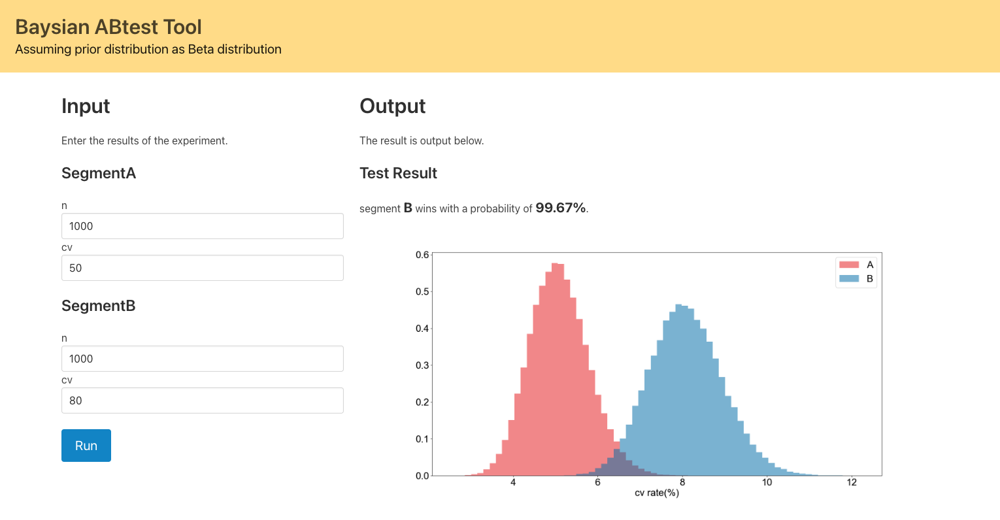

# Baysian ABtest Tool

## Start

```
# clone repo
git clone https://github.com/CozyRats/baysian-abtest-tool.git

# Start HTML App
uvicorn run:app --reload

# Access File
http://127.0.0.1:8000/
```

## Screenshot




## Prerequisite

- The conjugate prior assumes a Beta distribution and a uniform distribution for the prior.

## Tags

- fastapi
- bulma